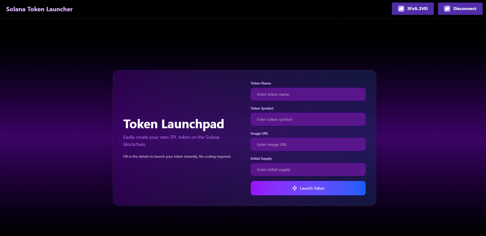

# Solana Token Launcher

This project is a React application that provides a user-friendly interface to create and launch your own SPL (Solana Program Library) tokens on the Solana blockchain. It simplifies the process of token creation, handling everything from minting to metadata initialization.

## Screenshot



## Tech Stack

- **React:** A JavaScript library for building user interfaces.
- **TypeScript:** A typed superset of JavaScript that compiles to plain JavaScript.
- **Vite:** A fast build tool and development server.
- **Tailwind CSS:** A utility-first CSS framework.
- **Solana Wallet Adapter:** A set of libraries for connecting to Solana wallets.
- **Solana Web3.js & SPL Token:** The Solana JavaScript API and token standards for creating and managing tokens.
- **Zod:** A TypeScript-first schema declaration and validation library.

## Getting Started

Follow these instructions to get a copy of the project up and running on your local machine for development and testing purposes.

### Installation

1.  Clone the repository:
    ```bash
    git clone https://github.com/Ritikchauhan1704/Solana_Token_Launcher
    ```
2.  Navigate to the project directory:
    ```bash
    cd Solana_Token_Launcher
    ```
3.  Install the dependencies:
    ```bash
    bun install
    ```

### Running the Application

To start the development server, run the following command:

```bash
bun dev
```

This will start the application in development mode. Open [http://localhost:5173](http://localhost:5173) to view it in the browser.
